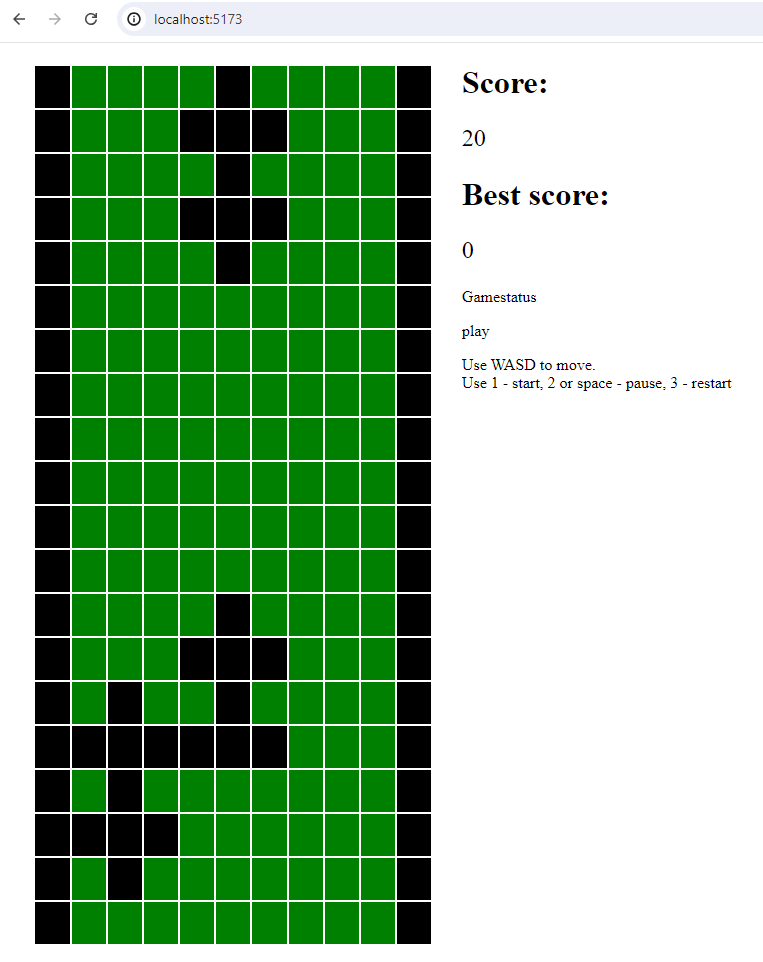

# Race_web_game

Here my realization of simple web race game from BrickGame

How to start on localhost

server 
port ougth to be 8000
```
make build_server
```

open on different terminal

web
port ougth to be 5173
```
make build_frontend
```

# Start game in web

Open in browser http://localhost:5173/

you will see 


